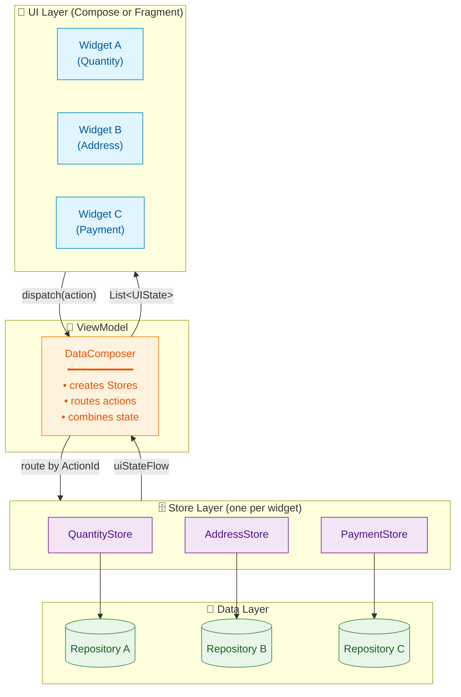

<div align="center">

```
  ╔═══════════════════════════════════════════════╗
  ║                                               ║
  ║      C O M P O S E R   L I B R A R Y          ║
  ║                                               ║
  ║   One Store per Widget. Composed at the top.  ║
  ║                                               ║
  ╚═══════════════════════════════════════════════╝
```

# Composer

**A widget-scoped, unidirectional state management library for Android — built for screens that have *many independent things going on at once*.**

[](https://github.com/12345debdut/composerlibrary/actions/workflows/ci.yml)
[](https://central.sonatype.com/artifact/io.github.12345debdut/composer)
[](https://kotlinlang.org)
[](https://developer.android.com)
[](LICENSE)

[**Quick Start**](#-quick-start) · [**Architecture**](#-architecture) · [**Core Concepts**](#-core-concepts) · [**When to Use**](#-when-to-use-composer) · [**Docs**](docs/)

</div>

---

## 🎯 What is Composer?

Composer is a **state management library for Android screens that are made up of many independent widgets** — like e-commerce checkout pages, dashboards, configurators, multi-step forms, or any screen where each "card" on the page has its own state, its own actions, and its own lifecycle.

Instead of stuffing every piece of state into one giant ViewModel, Composer gives **each widget its own `Store`**. Stores are independent, testable in isolation, and composed together at the screen level by a `DataComposer`. Data flows in one direction: actions go down, state flows up, and everything is observable as a Kotlin `Flow`.

### The problem it solves

Most state management libraries assume a screen has **one** state. That works great for a login screen. It does **not** work great for:

- A checkout page with quantity selector + address card + payment method + promo code + order summary + delivery options
- A dashboard with 8 independent cards each fetching from different sources
- A product configurator with size, color, engraving, gift-wrap, and warranty as independent widgets
- Any screen where individual widgets need to be added, removed, or reordered at runtime

With a single big ViewModel, every widget update triggers a state diff for the entire screen, every widget mutation goes through one giant `when` block, and unit tests need to construct the entire world to test one button. **Composer fixes this by making each widget its own first-class state owner.**

---

## 🏗 Architecture



### Data flow at runtime

```mermaid
sequenceDiagram
    autonumber
    participant U as User / UI
    participant VM as ViewModel
    participant DC as DataComposer
    participant S as Store (Widget X)
    participant R as Repository

    U->>VM: tap "Increment"
    VM->>DC: dispatch(IncrementAction)
    DC->>DC: lookup stores subscribed<br/>to IncrementActionId
    DC->>S: receive(IncrementAction)
    S->>S: updateState { copy(count = count + 1) }
    S-->>DC: new state via uiStateFlow
    DC-->>VM: combined List&lt;UIState&gt;
    VM-->>U: re-render only Widget X

    Note over S,R: Stores can also subscribe to<br/>repository flows in onStoreReady()
    R->>S: external data update
    S->>S: updateState { ... }
    S-->>DC: new state
    DC-->>VM: combined List&lt;UIState&gt;
    VM-->>U: re-render
```

### Why this shape works

- **Each widget is independent.** Adding a new widget = adding a new `Store` class. No central `when` block to edit. No giant state class to extend.
- **Stores are unit-testable in isolation.** No Android, no Compose, no ViewModel — just `Store + fake repository + assert state`.
- **The screen composition is data, not code.** A list of `WidgetId`s describes the screen. The ViewModel doesn't know which widgets it's hosting.
- **Actions are routed by ID, not by class hierarchy.** Stores declare which `ActionId`s they care about; the `DataComposer` does the routing.
- **Side effects have a typed channel.** UI actions (toasts, navigation) and cross-widget actions (refresh-everything) are separate from state updates.

---

## 🚀 Quick Start

### 1. Add the dependency

```kotlin
// build.gradle.kts
dependencies {
    implementation(platform("io.github.12345debdut:composer-bom:1.0.0"))
    implementation("io.github.12345debdut:composer")              // core
    implementation("io.github.12345debdut:composer-compose")      // optional: Jetpack Compose
    implementation("io.github.12345debdut:composer-fragment")     // optional: Fragment helpers
}
```

Published to **Maven Central** — no extra repository config needed. Composer is a **Kotlin-only** library; Java is not officially supported.

### 2. Define a State

```kotlin
data class CounterState(
    override val widgetId: WidgetId = CounterWidgetId,
    override val visible: Boolean = true,
    override val type: UIStateType = UIStateDefaultType,
    val count: Int = 0
) : UIState
```

### 3. Define a Store

```kotlin
class CounterStore : Store<CounterState, InitModel>() {
    override val storeId = CounterStoreId
    override val subscribedStoreAction = setOf(IncrementActionId, DecrementActionId)

    override fun initialize(globalModel: InitModel) {
        emitState { CounterState() }
    }

    override suspend fun receive(action: StoreAction, storeId: StoreId) {
        when (action) {
            is IncrementAction -> updateState { copy(count = count + 1) }
            is DecrementAction -> updateState { copy(count = count - 1) }
        }
    }
}
```

### 4. Observe in Compose

```kotlin
@Composable
fun CounterScreen(viewModel: CounterViewModel) {
    val states by viewModel.collectAsState()
    val count = states
        .filterIsInstance<CounterState>()
        .firstOrNull()
        ?.count ?: 0

    Column {
        Text("Count: $count")
        Button(onClick = { viewModel.dispatch(IncrementAction) }) { Text("+") }
        Button(onClick = { viewModel.dispatch(DecrementAction) }) { Text("−") }
    }
}
```

That's the whole loop. Add a second widget? Add a second `Store` class. The ViewModel doesn't change.

---

## 🧩 Core Concepts

| Concept | What it is | Lives in |
|---|---|---|
| **`UIState`** | Immutable data class describing what one widget should render. Has a `widgetId`, a `visible` flag, and your own fields. | `composer` |
| **`Store`** | The brain of one widget. Holds its `UIState`, processes actions, talks to repositories. **One Store per widget.** | `composer` |
| **`StoreAction`** | An intent handled by a `Store` (e.g. `IncrementAction`). Routed by `ActionId`. | `composer` |
| **`DataComposer`** | Coordinator that creates `Store`s for a screen, routes actions to them, and combines their state into a `List<UIState>`. | `composer` |
| **`DataComposerAction`** | An action handled by the `DataComposer` itself (cross-widget operations like "refresh everything"). | `composer` |
| **`UIComposerAction`** | A side effect for the UI layer (show toast, navigate, open dialog). Bubbles up via a `SharedFlow`. | `composer` |
| **`WidgetId`** | A typed identifier for a widget instance on a screen. Used to address actions and state. | `composer` |

### DataComposer variants

Pick the one that matches your screen layout:

| Variant | Use when |
|---|---|
| `SingleDataComposer` | The screen is one widget (login form, splash) |
| `ListDataComposer` | The screen is a vertical list of independent widgets (dashboard, checkout) |
| `ListWithHeaderAndFooterDataComposer` | List with a fixed header and footer that have their own state (cart with totals footer) |

---

## 🤔 When to use Composer

### ✅ Composer is a great fit when…

- Your screen has **3+ independent widgets** that each have their own state and actions
- Widgets need to be **added, removed, or reordered at runtime** based on backend config
- Different widgets fetch from **different repositories**
- You want to **unit-test each widget's logic** without standing up the whole screen
- You have **multiple screens that share widgets** (e.g. a "PromoCode" widget on cart, checkout, and order details)

### ❌ Reach for something simpler when…

- Your screen is one form or one detail view → a plain `ViewModel + StateFlow` is enough
- You're building a single-screen prototype → don't pay the architecture cost
- Your team has no appetite for learning a per-widget mental model → use MVI/MVVM instead

Composer is opinionated. The opinion is: **complex screens deserve a per-widget architecture, simple screens don't need one.**

---

## 📦 Modules

| Artifact | Purpose | When you need it |
|---|---|---|
| `io.github.12345debdut:composer` | Core — Stores, Actions, Composers, State, ViewModels | Always |
| `io.github.12345debdut:composer-compose` | Jetpack Compose extensions — `collectAsState()`, `CollectSideEffect()` | If your UI is Compose |
| `io.github.12345debdut:composer-fragment` | Fragment base classes for View-based UI | If your UI is XML/Fragment |
| `io.github.12345debdut:composer-bom` | Bill of Materials — version alignment for all four | Recommended, always |

The BOM means you only pin **one** version and the rest stay in lock-step.

---

## 📚 Documentation

| Guide | Description |
|---|---|
| [Getting Started](docs/getting-started.md) | Installation and full 7-step walkthrough |
| [Architecture](docs/architecture.md) | Data flow diagram and component overview |
| [Core Concepts](docs/core-concepts.md) | Stores, Actions, Composers, State |
| [Compose Integration](docs/compose.md) | `collectAsState()`, `CollectSideEffect()` |
| [Testing](docs/testing.md) | Testing Stores in isolation |
| [Publishing](PUBLISHING.md) | Publishing to Maven Central |
| [Troubleshooting](TROUBLESHOOTING.md) | Common issues and solutions |
| [Changelog](CHANGELOG.md) | Version history |

---

## 🛠 Publishing (maintainer runbook)

Composer publishes to **Maven Central** via the **Central Publisher Portal**
(`ossrh-staging-api.central.sonatype.com`). The flow is automated by
`.github/workflows/publish.yml`.

### Required GitHub repo secrets

Configure under **Settings → Secrets and variables → Actions**. All five are
mandatory; the workflow's diagnostic step fails fast if any are missing.

| Secret name | Value |
|---|---|
| `MAVEN_CENTRAL_USERNAME` | Central Portal user token **name** (https://central.sonatype.com → Account → Generate User Token) |
| `MAVEN_CENTRAL_PASSWORD` | Central Portal user token **secret** |
| `SIGNING_KEY_ID` | Last 8 hex chars of the GPG key used for signing |
| `SIGNING_PASSWORD` | Passphrase of that GPG key |
| `GPG_PRIVATE_KEY` | Full ASCII-armored private key (`gpg --armor --export-secret-keys KEYID`), including `-----BEGIN/-----END` markers and real newlines |

### Release flow

1. Bump `LIBRARY_VERSION` (and `VERSION_NAME`) in `gradle.properties`
2. Commit and push to `main`
3. Create a GitHub Release with tag `vX.Y.Z` — the tag and `gradle.properties`
   version **must match** or the workflow fails
4. Workflow runs: tests → API check → publish all four modules to staging →
   promote staging into a Central Portal deployment
5. Open https://central.sonatype.com/publishing, find the new deployment,
   click **Publish**

### Local publish (dry run to MavenLocal)

```bash
./gradlew \
  :composer:publishReleasePublicationToMavenLocal \
  :composer-compose:publishReleasePublicationToMavenLocal \
  :composer-fragment:publishReleasePublicationToMavenLocal \
  :composer-bom:publishBomPublicationToMavenLocal
```

Local publishing requires `signingInMemoryKey/Id/Password` and
`SONATYPE_USERNAME/PASSWORD` in `~/.gradle/gradle.properties` (never commit).

---

## 🤝 Contributing

Contributions welcome. Please open an issue before starting major changes.

1. Fork the repo
2. Create a feature branch
3. Make your changes (ensure `./gradlew build` and `./gradlew apiCheck` pass)
4. Open a Pull Request

See [Contributing Guide](CONTRIBUTING.md) and [Code of Conduct](CODE_OF_CONDUCT.md).

---

## 📄 License

```
Copyright 2024 Debdut Saha

Licensed under the Apache License, Version 2.0
```

See [LICENSE](LICENSE) for the full text.

---

<div align="center">

**Built with ❤️ for Android developers who refuse to accept that complex screens have to be complicated.**

</div>
