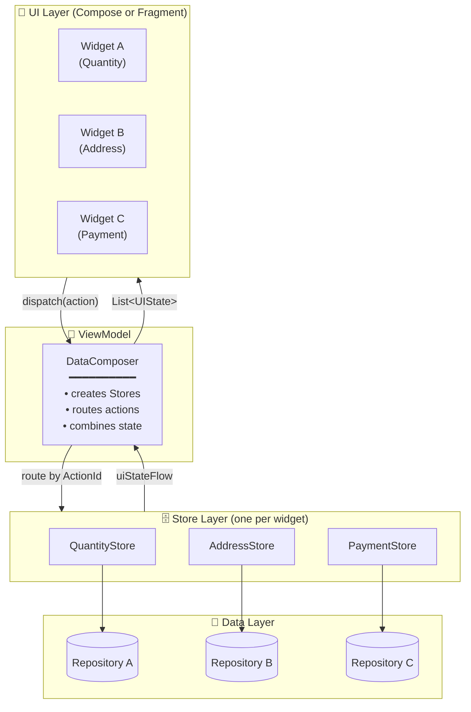

# Composer
{: .fs-9 }

A widget-scoped, unidirectional state management library for Android — built for screens that have **many independent things going on at once**.
{: .fs-6 .fw-300 }

[Get Started](getting-started.html){: .btn .btn-primary .fs-5 .mb-4 .mb-md-0 .mr-2 }
[View on GitHub](https://github.com/12345debdut/composer){: .btn .fs-5 .mb-4 .mb-md-0 .mr-2 }
[API Reference](api/composer/){: .btn .fs-5 .mb-4 .mb-md-0 }

---

## Why Composer?

Most state management libraries assume a screen has **one** state. That works great for a login screen. It does **not** work great for:

- 🛒 A **checkout page** with quantity selector + address card + payment method + promo code + order summary
- 📊 A **dashboard** with 8 independent cards each fetching from different sources
- 🎨 A **product configurator** with size, color, engraving, gift-wrap, and warranty as independent widgets
- 📝 Any screen where widgets need to be **added, removed, or reordered at runtime**

With a single big ViewModel, every widget update triggers a state diff for the entire screen, every widget mutation goes through one giant `when` block, and unit tests need to construct the entire world to test one button.

**Composer fixes this by making each widget its own first-class state owner.**

{: .important }
> Composer is opinionated. The opinion is: **complex screens deserve a per-widget architecture, simple screens don't need one.**

---

## Architecture at a glance



[Read the full architecture guide →](architecture.html)

---

## 🚀 Quick Start

### 1. Add the dependency

```kotlin
// build.gradle.kts
dependencies {
    implementation(platform("io.github.12345debdut:composer-bom:1.0.0"))
    implementation("io.github.12345debdut:composer")
    implementation("io.github.12345debdut:composer-compose")   // optional: Compose
    implementation("io.github.12345debdut:composer-fragment")  // optional: Fragment
}
```

### 2. Define a State

```kotlin
data class CounterState(
    override val widgetId: WidgetId = CounterWidgetId,
    override val visible: Boolean = true,
    override val type: UIStateType = UIStateDefaultType,
    val count: Int = 0
) : UIState
```

### 3. Define a Store

```kotlin
class CounterStore : Store<CounterState, InitModel>() {
    override val storeId = CounterStoreId
    override val subscribedStoreAction = setOf(IncrementActionId)

    override fun initialize(globalModel: InitModel) {
        emitState { CounterState() }
    }

    override suspend fun receive(action: StoreAction, storeId: StoreId) {
        if (action is IncrementAction) updateState { copy(count = count + 1) }
    }
}
```

### 4. Observe in Compose

```kotlin
@Composable
fun CounterScreen(vm: CounterViewModel) {
    val states by vm.collectAsState()
    val count = states.filterIsInstance<CounterState>().firstOrNull()?.count ?: 0
    Text("$count")
}
```

That's the whole loop. Add a second widget? Add a second `Store` class. The ViewModel doesn't change.

---

## ✨ Key Features

| Feature | What it means |
|---|---|
| 🧩 **One Store per widget** | Each widget owns its state, actions, and lifecycle. No giant ViewModels. |
| 🔀 **Action routing by ID** | Stores declare which `ActionId`s they care about. DataComposer routes automatically. |
| 🔬 **Unit-testable in isolation** | Test a Store with a fake repository. No Android, no Compose, no ViewModel. |
| 🧱 **Three composition modes** | `Single`, `List`, and `List+Header+Footer` — pick what matches your screen. |
| ⚡ **Runtime widget composition** | The screen is a `List<WidgetId>`. Add, remove, reorder at runtime from backend config. |
| 🎯 **Typed side effects** | UI actions (toasts, nav) and cross-widget actions have separate channels. |
| 🔄 **Reactive by default** | Everything is a Kotlin `Flow`. Works with Compose `collectAsState` out of the box. |
| 📦 **BOM-managed versions** | One version pin. The rest stay in lock-step. |

---

## 🤔 When to use Composer

### ✅ Great fit when…

{: .highlight }
> - Your screen has **3+ independent widgets** with their own state and actions
> - Widgets need to be **added, removed, or reordered at runtime** based on backend config
> - Different widgets fetch from **different repositories**
> - You want to **unit-test each widget's logic** without standing up the whole screen
> - You have **multiple screens that share widgets** (e.g. a "PromoCode" widget on cart, checkout, and order details)

### ❌ Reach for something simpler when…

{: .warning }
> - Your screen is one form or one detail view → a plain `ViewModel + StateFlow` is enough
> - You're building a single-screen prototype → don't pay the architecture cost
> - Your team has no appetite for learning a per-widget mental model → use MVI/MVVM instead

---

## 📦 Modules

| Artifact | Purpose |
|---|---|
| `io.github.12345debdut:composer` | Core — Stores, Actions, Composers, State |
| `io.github.12345debdut:composer-compose` | Jetpack Compose extensions |
| `io.github.12345debdut:composer-fragment` | Fragment base classes for View-based UI |
| `io.github.12345debdut:composer-bom` | Bill of Materials — version alignment |

---

## 📚 Documentation

<div class="code-example" markdown="1">

[**Getting Started**](getting-started.html) — Installation and full 7-step walkthrough
<br>
[**Architecture**](architecture.html) — Data flow diagram and component overview
<br>
[**Core Concepts**](core-concepts.html) — Stores, Actions, Composers, State
<br>
[**Compose Integration**](compose.html) — `collectAsState()`, `CollectSideEffect()`
<br>
[**Testing**](testing.html) — Testing Stores in isolation
<br>
[**API Reference**](api/composer/) — Full Dokka-generated API docs

</div>

---

## Requirements

- **Android** minSdk 24+
- **Kotlin** 1.9+
- **Gradle** 8.0+
- Kotlin-only (Java is not officially supported)

---

{: .note }
> Composer publishes to **Maven Central** — no extra repository config needed.
> Add the dependency and you're ready to go.

---

<div align="center" markdown="1">

**Built with ❤️ for Android developers who refuse to accept that complex screens have to be complicated.**

[⭐ Star on GitHub](https://github.com/12345debdut/composer){: .btn .btn-outline }
[📦 Maven Central](https://central.sonatype.com/artifact/io.github.12345debdut/composer){: .btn .btn-outline }

</div>
